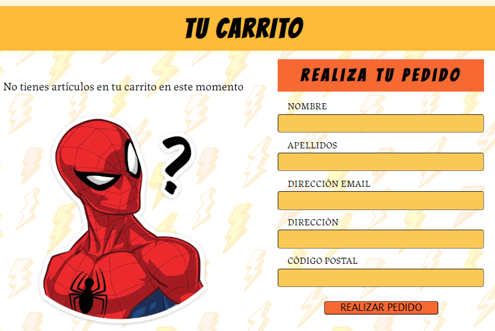

# Comic Shop Project with REACT

This is a full-stack application built with REACT for the frontend and NODE.js and Express for the backend. The web application focuses on displaying and interacting with a comic database. The application uses various React hooks such as `useParams`, `useContext`, `useState`, `useEffect`, and `useForm` from the "react-hook-form" library.

## Database

The application relies on a comic database created in MONGODB Atlas and uses the MONGOOSE library to interact and make HTTP requests to it.

### Frontend Routing

The application uses React Router DOM for routing and rendering different views in the frontend. The following routes are available:

- **Home**: With a navigation bar and search bar that redirects to the Results view when searching. There's a component with cards showcasing different popular characters in the store, which leads to the Results view to find comics related to those characters. The search bar allows finding comics from the database by title, character, or collection.

This view also includes a section or component for novelties (Novelties). It's a gallery with horizontal scroll to visualize different cards of new comics. In the next version, a carousel of cards will be added.

- **Sections**: Sections like MANGA, SUPERHEROES, CLASSICS, or GENRES lead to key views where you can find more subcategories.

- **Results**: Perhaps the most used view in the web navigation. Sections like MANGA, SUPERHEROES, CLASSICS, or GENRES, in addition to the search bar, redirect to this component that displays cards with information about the searched comics. The comics are shown in groups of 3 to play with pagination coded from the backend in the controllers.

In this view, we have incorporated the React Card Flip library to create the effect of flipping the cards and showing the description information related to the comics.

 

All cards have an "Add to Cart" button to carry the selected product information to the Trolley view through the useContext hook.

- **Trolley**: Trolley is responsible for visualizing the order and creating it by asking the user for information to be entered into the MongoDB database along with the product data.

### Backend Routing

The backend is built with Node.js + Express. It also implements various libraries and frameworks such as JSDoc, Swagger, Helmet, Axios, Mongoose, etc.
In the backend, we configure the MongoDB database with a password and design the Mongoose schema models to create the data and implement it in the controllers.In addition, in the controllers, we designed pagination for the GET HTTP requests to the API.

There are several controllers used to create, search, and edit the database, although in practice, the frontend only uses a couple of endpoints.

The connection between the backend and frontend is done through the configuration file of Vite, including the URL of the backend server.

### Future Implementations

For future versions, I plan to implement a hamburger menu for the mobile version. An authentication process for users to make purchases might also be added, which could involve changing or introducing a SQL database.
Additionally, more sections like a listing of store events by dates are expected to be included in the future.

The above is a summary of a GitHub repository. Here's the translated text and code in a Markdown format.
